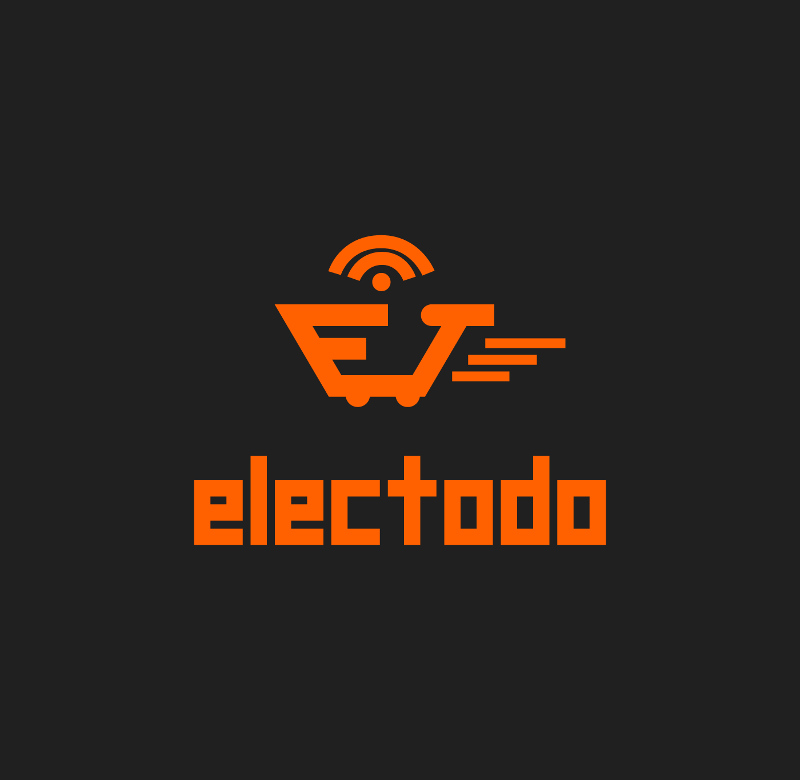

# Electodo

## **Comisión 6**
---
## **Grupo 13**
___

### **Integrantes:**
-
___
-  Sergio Romero
   
   24 años.

   estudiante ingenieria de informatica y programacion.

   florencio varela, buenos aires.

   tecnico de refrigeracion, reparador pc, electricista.
___
-  Rocío Recalde

   18 años.
   
   Villa Celina, Buenos Aires.

   Estudiante de diseño gráfico y programación. 

   Vegana, artista plástica.
___
-  Nestor Agustin Vega.

   27 años.

   San Miguel, Buenos Aires.

   Músico amateur, Vendedor de oficio, Programador Web Trainee.
___

### **Temática:**
ElecTodo, es una empresa que se dedica a la importación, comercialización y distribución en todo el país de productos y accesorios electronicos, con mas de 15 años de experiencia.
Esto nos permite posicionarnos como una compañia reconocida por su seriedad, responsabilidad y excelente atención.

Contamos con un amplio surtido de productos ofreciendo la mejor relacion precio/calidad como concecuencia de nuestra excelente vinculacion con el exterior y presencia en las exposiciones mas importantes del mundo, para seguir actualizando dia a dia a nuestros Clientes. Brindamos asesoramiento personalizado a nuestros Clientes mediante un Staff de Venta y Adminitración, suministrando las mejores soluciones a sus compras.

Buscamos que nuestro cliente reconozca siempre nuestros objetivos de trabajo:

Calidad de atención, Originalidad y Calidad de producto, Entrega inmediata y Stock permanente.
Para estar mas cerca de nuestros clientes, ofrecemos el envió de nuestros productos a todo el país de manera rápida, segura y eficaz.
 
Ante cualquier duda, nos podes escribir a elec@Todo.com.ar

### **Referencias**
- [Seven Electronics](https://www.sevenelectronics.com.ar/ofertas.php)

- [Amazon](https://www.amazon.com/-/es/)

- [Compumundo](https://www.compumundo.com.ar/)

- [Binah Deco](https://www.binahdeco.com.ar/)

- [Compra Gamer](https://compragamer.com/)

-

### **Tipografías:**

- Roboto

- OpenSans

- Font Awesome

- Segoe UI

### **Paleta de color**

 
